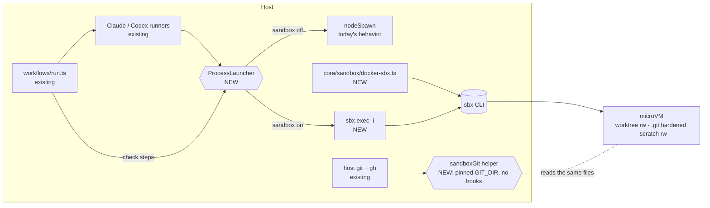

# Docker Sandboxes — run each task inside its own microVM

## 📝 TLDR

People who flip **Autonomous** and walk away want each agent run cut off from their host. Today every agent (`claude`, `codex app-server`) and every workflow check step (`bash -lc "npm test"`) runs as a plain child process on the host, with the user's full permissions. Worktrees keep runs apart from each other; nothing keeps them apart from the machine.

**Proposed (future behavior):** when Docker's `sbx` CLI is installed, the New Task composer shows a **Sandbox** toggle. A sandboxed run gets its own [Docker Sandbox](https://docs.docker.com/ai/sandboxes/) microVM, created at its first step and removed with the run. Its agent steps and check steps execute inside that microVM. The VM sees only three things, each at its host path: the run's worktree, a hardened view of the repo's `.git`, and a per-run scratch directory. It never sees the main checkout, cezar's own state, or the rest of the home directory. Host-side git, diffs, the review gate and PR push keep working on the host, and are hardened so nothing the VM writes can make them run code. Without `sbx`, nothing changes: the toggle is absent.

## 📝 Resolved decisions

Answered by the owner on 2026-09-22 at the Open Questions gate.

| # | Question | Answer |
|---|----------|--------|
| Q1 | Scope | **Per-run sandbox.** cezar stays on the host and puts each run in its own sandbox. Running the whole cockpit inside one sandbox is out of scope; it works today with `--bind-host 0.0.0.0` and gets a README recipe. |
| Q2 | Sandbox lifetime | **One per run.** It is stopped when the run reaches a terminal state, and removed when the run is deleted, loses a variant pick, or has its worktree reclaimed by retention. It survives Continue, crash recovery and usage-limit auto-resume, because resuming a session needs that session's state inside the VM. |
| Q3 | How it's switched on | **Auto-detected, with a per-run composer toggle, off by default**, copying the Autonomous toggle's path. |
| Q4 | What runs inside | **Agent steps and workflow check steps.** If checks stayed on the host, an agent could plant a harmful test script and cezar would run it outside the VM. |
| Q5 | Agent credentials | **sbx's own credential handling.** cezar forwards no provider keys or tokens into the VM. |
| Q6 | Backends in v1 | **Claude and Codex.** OpenCode is excluded: cezar talks to it over a loopback HTTP port, which would need `sbx ports` per run. |

## 📝 Problem Statement

- **No isolation layer exists.** Agents start through a direct `nodeSpawn` in `core/claude-cli-runner.ts:96` and `core/codex-app-server-transport.ts:33`, chosen by `core/runner-factory.ts:12`. Check steps start through `spawn('bash', ['-lc', command], { env: process.env })` in `workflows/run.ts:3486`, and get the **full** host environment, not the curated `buildChildEnv` allowlist.
- **The agents' own guards are off by design.** Claude runs `--permission-mode dontAsk` with unrestricted `Bash` (`DEFAULT_ALLOWED_TOOLS`, `workflows/types.ts:185`). Codex runs `approvalPolicy: 'never'` with `sandbox: 'danger-full-access'` by default, because bubblewrap can't create a UID map in containers (#563, `codex-app-server-runner.ts:338-347`). The permission-modes spec (`.ai/specs/2026-07-17-permission-modes.md`) is approved but unimplemented.
- **The exposure is exactly what the autonomous story sells.** The README pitches a VPS "dev team that's always on", with queued autonomous runs and nobody watching. One prompt injection (an issue body, a dependency's postinstall, a hostile repo file) can read `~/.ssh`, `~/.aws`, the agents' OAuth tokens in `~/.claude`, or every other project on the box.
- **The tool now exists.** Docker Sandboxes (`sbx` v0.45.0, free for commercial use with a Docker account) gives each agent a microVM:
  - it mounts host directories at the same absolute path with instant two-way passthrough;
  - it applies a default-deny network policy with a baseline allowlist;
  - it injects credentials through a host proxy, so the VM only ever sees sentinel values;
  - Claude Code and Codex are first-class agents in it.

## 📝 Proposed Solution

Add one seam, a **process launcher**, between the runners and `child_process`, plus one **hardened host-git helper**. Everything else follows from them.

- A run carries `sandbox: true`. At its first agent or check step, cezar creates the VM with `sbx create`. From then on, every process the run starts goes through `sbx exec -i -w <cwd> --env-file <f> <sandbox> <bin> <args…>`, not `nodeSpawn(bin, args)`.
- The runners' wire protocols don't change. Claude's stream-json and Codex's app-server JSON-RPC ride on the `sbx exec` client's stdio.
- cezar's own git and `gh` work stays on the host: worktree creation, autosave, diff, commit, push, and PR creation. For sandboxed runs, every host git call goes through a helper that pins the git directories and disables repo-controlled execution (see **Host-git hardening**).
- The planner and auto-namer stay on the host. Both run with `allowedTools: []` (`planner.ts`, `auto-name.ts:167`), so they have no tool surface to isolate.

**Alternatives considered:**

| Option | Why it lost |
|---|---|
| Run the whole cockpit inside one sandbox | All runs share one VM, and host git and `gh` move inside too. It works today without code, so it's a README recipe. |
| Mount the repo root as the primary workspace | This was the first draft. It lets the VM write cezar's state (`runs.json`, workflow `command`s that later run on the host), the main checkout (`package.json` scripts the user runs), and every other run's worktree. The adversarial review rated it Critical. |
| `sbx --clone` mode | cezar's host-side autosave, live diff, "open in editor" and review gate read the worktree directly, and clone mode hides the agent's work until it's fetched. It's also rejected from inside a non-main worktree. |
| Plain Docker container per run (OpenHands-style or the Claude devcontainer) | A shared kernel is a weaker boundary, and cezar would have to build credential isolation itself. The devcontainer docs warn that the agent can exfiltrate `~/.claude`; `sbx`'s sentinel-token proxy closes exactly that hole. |
| `sbx run` instead of `create` + `exec` | `sbx run` attaches a terminal and rewrites the agent's default flags. cezar needs a pipe it controls. kpenfound/busybees#811 reached the same conclusion independently. |
| A generic pluggable-runtime abstraction | Only one provider exists. `ProcessLauncher` is the extension point, and a second provider implements it later. |

## 📝 Architecture



In short, the runners and the engine only change the object they spawn through. One module owns every `sbx` call. Host git keeps operating on the shared files, but through a helper that ignores anything the VM could have redirected.

### New modules

- **`core/process-launcher.ts`**: `ProcessLauncher { spawn(bin, args, { cwd, env }): ChildProcessWithoutNullStreams; readonly kind: 'host' | 'sandbox' }`.
  - `hostLauncher` is today's `nodeSpawn`.
  - `sandboxLauncher(name)` writes the env to a `0600` file under `~/.cache/cez/sbx-env/`, which is outside every mount. It spawns `sbx exec -i -w <cwd> --env-file <file> <name> <bin> <args…>` and deletes the file once the child has started. Env values never appear in `ps`.
  - This is also the spawn DI point the runners lack today.
- **`core/sandbox/docker-sbx.ts`**: the only module that runs `sbx`, resolved as `CEZ_SBX_BIN ?? 'sbx'`.
  - `detect()` is **passive**: `sbx version --json` only, cached per process. It never starts the sandbox daemon (see Zero config).
  - `ensure(run)` is idempotent: `sbx ls --json`, then reuse the named VM if it exists with the expected workspaces, `rm --force` it if it's mismatched, and `create` it if it's missing.
  - `stop(name)`, `remove(name)`, and `list()`. `list()` strips the "Starting sandboxd daemon…" text printed before the JSON (docker/sbx-releases#201).
- **`core/sandbox/sandbox-git.ts`**: `sandboxGitEnv(run)` returns the env and `-c` overrides every host git call must use for a sandboxed run's worktree (see Host-git hardening).

### Changed modules

- **`core/agent-runner.ts`**: `AgentRunSpec` gains an internal `launcher?: ProcessLauncher` (not a contract field). `claude-cli-runner.ts` and `codex-app-server-transport.ts` spawn through `spec.launcher ?? hostLauncher`. Inside a VM, the binary is the plain name `claude` / `codex`; host `CEZ_*_BIN` paths don't exist there.
- **`workflows/run.ts`**:
  - `execute` and `runContinuation` resolve the run's launcher once, and `runCheckStep` uses it.
  - For sandboxed runs, the env is reduced to:
    - the run's own variables: `CEZ_HANDOFF_FILE`, `CEZ_TASK_ID`, `CEZ_TODOS_FILE`, and `TMPDIR`/`TEMP`/`TMP`, all pointing into the per-run scratch directory;
    - names the user explicitly listed in `CEZ_ENV_PASSTHROUGH`, which the docs say are visible to the agent.
  - Provider keys, `GH_*`, `SSH_AUTH_SOCK`, `CLAUDE_CONFIG_DIR` and `CODEX_HOME` are never forwarded, per Q5; sbx's own docs warn that env vars defeat proxy isolation.
  - The `sandbox` flag is threaded wherever `autonomous` is (`StartRunInput`, `ActiveRun`, persistence at `:739`, queued-restart re-threading at `:1043-1047`).
- **Per-run files for sandboxed runs** move into the scratch directory `.ai/cezar/sandbox/<runId>/`: `handoff.md`, `todos.json`, `tmp/`, and copies of pasted images. The handoff path is resolved per run. The per-run `todos.json` is validated with the existing schema and merged into the global inbox by the host when each step ends, so the VM never writes the shared `.ai/cezar/todos.json`. The directory is added to `ensureDataGitignore` and deleted with the run.
- **`core/codex-app-server-runner.ts`**: inside a VM, always send `sandbox: 'danger-full-access'` and `approvalPolicy: 'never'`. The VM is the boundary, and nesting bubblewrap would only reproduce #563. `CEZ_CODEX_NETWORK=0` doesn't apply to sandboxed runs; network is governed by the user's sbx policy. The run log says so when the variable is set.
- **Host git call sites** (`git-worktree.ts`, `server/git.ts`, `server/git-changes.ts`, `git-diff-base.ts`, `git-refs.ts`, `server/forge/github.ts` push and PR paths) take the hardened env when the worktree belongs to a sandboxed run. A lookup from worktree path to run record gives the call sites that lack run context today a way to find it.
- **Run lifecycle hooks**:
  - Reaching `review`, `done` or `failed` → `stop`. The VM keeps its state for Continue, and a stopped VM costs disk, not RAM.
  - Cancel → kill the `sbx exec` client, then `stop`. Killing the client isn't documented to signal the inner process.
  - `DELETE /runs/:id`, variant-loser cleanup, and `retention.reclaimWorktrees` → `remove`.
  - Boot → reconcile (see Failure modes).
- **`server/server.ts` `resumeCommand`**: for a sandboxed run, "Open in CLI" returns `sbx exec -it -w <cwd> <sandbox> claude --resume <id>` (or `codex resume <id>`). The host has no copy of that session.

### Sandbox creation

```bash
sbx create --quiet --name cez-<runId> --pull missing --skills off \
  --template docker.io/docker/sandbox-templates:<claude-code|codex> \
  [--memory <resources.memoryLimitMb>m] \
  <claude|codex> \
  <worktree> \
  <repoRoot>/.git \
  <repoRoot>/.git/config:ro  <repoRoot>/.git/hooks:ro  <repoRoot>/.git/info:ro \
  <repoRoot>/.git/worktrees/<id>/commondir:ro  <repoRoot>/.git/worktrees/<id>/gitdir:ro \
  <repoRoot>/.ai/cezar/sandbox/<runId> \
  [<global skill dirs the run's skill references>:ro]
```

- **The primary workspace is the worktree, and the main checkout is never mounted.**
  - A worktree's `.git` gitlink points to `<repoRoot>/.git/worktrees/<id>`. Mounting `.git` at its host path lets that resolve. Phase 0 must prove this; sbx's docs only say a worktree-only mount has *no* git access.
  - `.git` has to be writable, because the agent commits into `objects/` and `refs/`. The files that steer execution or redirect git are held read-only through sbx's single-path `:ro` hold-outs: `config`, `hooks/`, `info/`, and this worktree's `commondir` and `gitdir`.
  - Other worktrees' admin dirs stay writable, but host git never reads through them for this run (see Host-git hardening).
- **Worktree is required.** `sandbox: true` with `worktree: false` is refused, because an in-place run's cwd is the main checkout.
- **Non-`-docker` template variants.** These are unprivileged and have no inner `dockerd` or 10 GB image store. Docker-in-sandbox is a later option.
- **`--skills off`** stops sbx from mounting its shared skills store. cezar's skills reach the agent through the system prompt and the worktree copy. Global skill directories the run references are added read-only at their absolute paths, so `skillSystemPrompt`'s reference paths resolve.
- **`--memory`** is a hard cap inside the VM (see the memory guard in Risks).

### Host-git hardening

The first draft relied on a read-only `.git/config` alone. The review showed two holes: the worktree's own `.git` gitlink file is agent-writable, and host git follows it to any git dir the agent chooses. Every host git invocation on a sandboxed run's worktree therefore runs with:

- `GIT_DIR=<repoRoot>/.git/worktrees/<id>`, `GIT_COMMON_DIR=<repoRoot>/.git` and `GIT_WORK_TREE=<worktree>`, pinned from host-side knowledge (the worktree path cezar created), never read from the gitlink or `commondir`;
- `-c core.hooksPath=/dev/null`, which also covers `core.hooksPath=.husky`-style setups that point hooks into the agent-writable worktree. Autosave already passes `--no-verify` (`git-worktree.ts:344`), and host commit and push stop running repo hooks for sandboxed runs. This is documented.
- `-c core.fsmonitor=false`;
- a refusal to start a sandboxed run when `extensions.worktreeConfig` is on, because `config.worktree` would be agent-writable.

Repo config is read-only in the VM, so the only drivers that can still run are ones the user configured themselves: `filter`, `diff.textconv` or `credential.helper` from `~/.gitconfig` or the protected repo config. `.gitattributes` in the worktree can *name* a driver but can't define one.

## 📝 Data Model

All changes are additive and optional, per BACKWARD_COMPATIBILITY.md §3 (the whole-array `safeParse` of `runs.json`) and §9.

- **Run record** (`runs/store.ts`, contract `runs.ts`):

  ```ts
  sandbox?: {
    provider: 'docker-sbx';
    name: string;          // cez-<runId>
    createdAt?: string;
    removedAt?: string;
  }
  ```

  A run without `sandbox` behaves exactly as today. `runs.json` isn't mounted in the VM, so the flag can't be cleared from inside to make a later Continue spawn on the host.
- **`~/.cezar/ui-state.json`**: `lastSandbox?: boolean`, alongside `lastAutonomous`.
- **New data directory**: `.ai/cezar/sandbox/`, added to `ensureDataGitignore` and swept by boot reconcile for runs that no longer exist.

## 📝 API Contracts

All changes are additive.

- **`POST /api/v1/runs`**: `sandbox?: boolean` (default `false`), in both `createRunInputBaseSchema` (`packages/contract/src/runs.ts`) and the server's `startRunSchema`, covered by `contract-parity.runs.test.ts`. Variants inherit it, and each variant gets its own VM.
- **`GET /api/v1/health`**: a new optional `capabilities.sandbox`:

  ```ts
  sandbox?: {
    provider: 'docker-sbx';
    state: 'available' | 'unsupported-version';
    version?: string;
    backends: Array<'claude' | 'codex'>;
  }
  ```

  - It is absent when `sbx` isn't on `PATH`.
  - It isn't in `checks`, because `tools-menu.tsx` flags every unavailable check as missing and would nag users who don't use sbx.
  - Sign-in state isn't probed here, because probing it would start the daemon. It surfaces when a sandboxed run starts.
- **Env contract** (`.env.example` and the README env table in the same commit, per AGENTS.md):
  - `CEZ_SBX_BIN`: path to the `sbx` binary, same semantics as `CEZ_CLAUDE_BIN`.
  - `CEZ_SANDBOX`: when unset, `sbx` is auto-detected and each run opts in. `0` skips detection entirely, so `capabilities.sandbox` is absent, the toggle is hidden and `sandbox: true` is refused; it's the kill switch for shared boxes. Any other value behaves as unset.

## 📝 Zero config

- There is no flag to turn the feature on: it's discovered, and each run opts in.
- Merely having `sbx` installed starts no process. `detect()` runs `sbx version` only.
- The sandbox daemon is touched in two cases: a sandboxed run starts, or boot reconcile finds sandboxed run records or a non-empty `.ai/cezar/sandbox/`. A user who never flips the toggle never gets a daemon.

## 📝 UI/UX

- **Composer**: a `SandboxToggle` chip next to `AutonomousToggle` / `WorktreeToggle` (`routes/new-task.tsx:676-686`), rendered only when `capabilities.sandbox` is present.
  - The toggle is disabled with a reason when:
    - the version is unsupported;
    - worktree is off;
    - the workflow uses OpenCode, or mixes Claude and Codex (one agent kit per VM in v1);
    - a non-default agent profile is selected (profile config dirs are host paths, and per-profile sbx credentials aren't designed yet).
  - The value is remembered in `lastSandbox`.
- **Task row and run view**: a "sandboxed" badge. Peak memory shows "—" with the tooltip "measured inside the sandbox".
- **Start and auth failures get hints, not raw errors**:
  - Signed out of Docker: "`sbx login`".
  - Claude unauthenticated in the VM: "Log Claude in for sandboxes once: `sbx run claude`, then `/login`".
  - Codex: "`sbx secret set openai --oauth`".
- **Network-policy failures**: the agent's own error is shown, and the docs point to `sbx policy log`.

## 📝 Edge Cases & Failure Scenarios

| Scenario | What happens / what the user sees |
|---|---|
| `sbx create` fails (signed out, pull failed, disk full) | The step fails before any agent starts, with `sbx`'s stderr and a hint in the run log. Continue retries. |
| cezar crashes mid-`create`, so the name is taken but `createdAt` is unset | `ensure()` finds the name. It reuses the VM if the workspaces match, otherwise runs `rm --force` and creates again. |
| VM gone at Continue or auto-resume (removed by hand, host rebuilt) | `ensure()` recreates it. The session file lived in the old VM, so the continuation starts a **new** session seeded with the handoff. The run log says the session was restarted. |
| cezar killed while a sandboxed step runs | Boot reconcile first runs `sbx stop` on this repo's `cez-*` VMs that belong to non-active runs, so a detached inner agent can't keep writing. Then today's `recover()` resumes the run. |
| Orphaned VMs (run deleted while cezar was down) | Reconcile runs `sbx ls --json`, filtered by name `cez-<uuid>` **and** a primary workspace under this repo's `.ai/cezar/worktrees/`, so other projects are never touched. It runs `rm --force` on those with no run record. |
| Several cezar processes on one repo | Reconcile's stop pass runs only while holding the repo lock (`acquireRepoRoot`). With `CEZ_DISABLE_REPO_LOCK=1`, it skips stopping and only removes VMs with no run record. |
| stdin EOF isn't delivered through `sbx exec` (docker/sbx-releases#505) | Long sessions end through `session.end()`, which now also stops the VM. One-shot calls are a Phase 0 go/no-go item. |
| Host uid ≠ 1000 | The VM's `agent` user (uid 1000) might write files the host can't handle. This is checked in Phase 0. If it's broken, `detect()` reports `unsupported-version` on such hosts, not a half-working toggle. |
| Check step relies on host env (`DATABASE_URL` and similar) | The reduced env drops it, and the step fails with its own error. Docs and the run log point to `CEZ_ENV_PASSTHROUGH`. |
| Native modules built in the VM on a macOS host | They won't load on the host. This is inherent and documented. |
| Slow file I/O on virtiofs | Up to 5× slower builds on macOS (docker/sbx issue #31). Shown only as duration. |
| Breaking `sbx` release (0.39→0.45 in five weeks) | `detect()` enforces a minimum version and `--help` probes for `--skills` and `:ro` hold-outs. A mismatch reports `unsupported-version`. |
| sbx writes a ~21k CLAUDE.md above the workspace (#204, #432) | Claude loads it as a parent memory file. Accepted in v1 and documented. |

## 📝 Risks & Impact Review

- **Host git on agent-writable files is the main escape class.** It's closed by pinned git dirs, read-only config, hooks, info and pointer files, and disabled hooks and fsmonitor. The residual risk is a git feature driven by repo *content* that nobody has listed yet. The gated real-sbx suite (Phase 5) tests the known vectors, and the git call-site list must stay complete: a new host git call on a worktree that skips the helper silently reopens the hole. A unit test enumerates git spawn sites.
- **Writable `.git` objects and refs.** The agent can rewrite any branch ref, including `main` and other runs' `cez/*` branches. This is no worse than today, and host push only pushes the run's own branch. Documented. Refs held read-only per branch are out of scope.
- **The memory guard is load-bearing.** Today it *pauses* a run so it can be resumed, and it feeds the runs table. For sandboxed runs, the VM `--memory` cap OOM-kills inside the VM instead. The step fails, and Continue resumes it through the normal path. Phase 0 checks whether per-VM memory usage is readable (`sbx inspect --json` or `ls`). If it is, the guard polls it and pauses by stopping the VM; if not, the table shows "—".
- **Disk.** Stopped VMs keep their disk until the run is deleted or retention reclaims its worktree. The non-`-docker` templates avoid the 10 GB inner image store. Variants multiply this, and losers are removed at pick.
- **GitHub credentials.** The README deliberately does **not** recommend `sbx secret set github`. It would let the agent push to or merge any repo through the proxy, bypassing the review gate. Host push already covers the PR flow; the docs name the risk for users who add it anyway.
- **External, fast-moving, proprietary dependency.** `sbx` is free but closed-source and requires a Docker account. The feature is optional and absent without it.
- **Contracts are additive only**: a run field, a POST field, a health capability, two env vars and a gitignored data dir. Rollback means hiding the toggle. Old records stay readable, and leftover VMs are removable with `sbx rm`.

## 📋 Implementation status (2026-09-22)

All seven phases are implemented on branch `feat/docker-sandboxes` (fork `roszekF/cezar`). Phase 0 results are in `.ai/analysis/docker-sandboxes-spike.md`. The real-sbx suite passed on sbx 0.45.0 (Ubuntu 24.04), including a real-Claude end-to-end run. Screenshots are in `assets/2026-09-22-docker-sandboxes/`.

**Where the code differs from the design above:**

- **Per-run directory.** `.ai/cezar/sandbox/<runId>/` holds only the handoff journal (`handoff.md`) and the temp dir (`tmp/`). `sbx` cannot mount a single file read-write, only directories. `handoffPath()` resolves into it whenever that directory exists, so every reader agrees without a registry.
  - Pasted images stay in `runs/<id>-images/` and are mounted read-only.
  - The follow-up inbox (`todos.json`) is not merged. It is simply **off** for sandboxed runs.
- **Temp directory.** `TMPDIR`, `TEMP`, `TMP` and `CLAUDE_CODE_TMPDIR` all point at the run directory's `tmp/`. Mount parents are root-owned inside the VM, and Claude refuses a temp dir it doesn't own.
- **Env passing.** Env reaches the VM as bare `-e NAME` flags, with values taken from the `sbx` client's own env (verified on 0.45). There is no env file.
- **Host-git hardening.** Pinned env alone does not override a rewritten `commondir`: git's ref store still reads it. The helper therefore snapshots `commondir` and `gitdir` and **fails closed** if either changes. Hooks and fsmonitor are turned off through `GIT_CONFIG_*` env, which also reaches `gh`'s git.
- **`CEZ_SANDBOX=0`** makes `capabilities.sandbox` absent. There is no `disabled` state.
- **Boot reconcile** stops *every* running `cez-*` VM of this repo, because at boot nothing is live yet in this process. It does not take the repo lock, and assumes one cezar process per repo.
- **Dispatch and `cez automation`** prompts are dropped for sandboxed runs, and dispatch is refused at the route.
- **Plan-first:** the toggle is disabled for plan-first runs.

**Deferred (not built):**

- **Memory guard.** It is not wired to VM memory. The VM is capped with the workspace memory limit instead, and the table's memory column shows only the `sbx` client.
- **Global skill directories.** These are not mounted into the VM (the skill body still reaches the agent through the system prompt).
- **Sandboxed plan-first runs.**
- **A per-run memory figure** in the tasks table.
- **Host uid ≠ 1000.** This is still untested (spike check d).


Each phase ships as its own PR and leaves cezar working.

1. **Phase 0: spike (go/no-go)** against a real, signed-in sbx.
2. **Phase 1: launcher seam.** No behavior change. It's also useful on its own, as spawn DI for runner tests.
3. **Phase 2: host-git helper.** Pinned-dir git for worktrees, a no-op for non-sandboxed runs. Tested in isolation.
4. **Phase 3: detection and health capability.** Inert.
5. **Phase 4: sandboxed runs, server-side.** Usable through the API.
6. **Phase 5: gated real-sbx isolation suite.**
7. **Phase 6: cockpit and docs.**

## 📋 Implementation Plan

### Phase 0: spike

1. `scripts/sbx-spike.sh` checks each item against a throwaway VM and records the results in `.ai/analysis/docker-sandboxes-spike.md`:
   - (a) byte-exact stdio through `sbx exec -i`, and stdin EOF reaching the inner process;
   - (b) exit-code pass-through, including 130/137/143;
   - (c) what killing the `sbx exec` client does to the inner process;
   - (d) host ownership of files written when the host uid is not 1000;
   - (e) that a Claude `/login` done once carries to a new VM under `sbx exec claude -p`;
   - (f) that a worktree-primary mount plus `<repo>/.git` resolves the gitlink, and the agent can commit;
   - (g) that the `:ro` hold-outs (`config`, `hooks/`, `info/`, `commondir`, `gitdir`) block writes while (f) still works;
   - (h) per-VM memory usage readable from the CLI;
   - (i) the latency of `sbx exec true`;
   - (j) that `sbx version --json` doesn't start the daemon.
2. Go/no-go: (a), (b), (f), (g) and (j) must pass. The others choose between the designed fallbacks. Update this spec with the results.

### Phase 1: launcher seam

1. `core/process-launcher.ts` with `hostLauncher`. Unit test: cwd and env are passed through.
2. Route `claude-cli-runner.ts` and `codex-app-server-transport.ts` through `spec.launcher ?? hostLauncher`. Existing runner tests stay green, and a new test injects a fake launcher and asserts the argv.
3. Route `runCheckStep` through a launcher, keeping `process.env` for host runs. Covered by the existing workflow tests.

### Phase 2: host-git helper

1. `core/sandbox/sandbox-git.ts`: pinned `GIT_DIR`/`GIT_COMMON_DIR`/`GIT_WORK_TREE`, plus `core.hooksPath=/dev/null` and `core.fsmonitor=false`. Tests: a redirected gitlink, a redirected `commondir`, a planted hook and `core.hooksPath=.husky` are all ignored.
2. A worktree-path → run lookup. Route every host git call site through `gitFor(worktree)`, which applies the helper only when the run is sandboxed. A test enumerates `spawn`/`execFile('git'…)` sites and fails on any that bypass `gitFor`.

### Phase 3: detection

1. `detect()` parses `sbx version --json`, with the minimum version and `--help` probes. Tested against recorded outputs.
2. `packages/cezar/scripts/fake-sbx.mjs`: `version`, `ls`, `create`, `exec` (runs locally in `-w`, honoring `--env-file`), `stop` and `rm`, over a JSON state file. Tests point `CEZ_SBX_BIN` at it.
3. The optional `capabilities.sandbox`, `CEZ_SBX_BIN` and `CEZ_SANDBOX` in `.env.example` and the README. Contract-parity and health tests cover the field absent, available, unsupported, and absent under `CEZ_SANDBOX=0`.

### Phase 4: sandboxed runs, server-side

1. `sandbox?: boolean` on `POST /runs` and the run record, threaded through `StartRunInput`, `ActiveRun`, persistence and queued restart. Test: the flag survives a restart of a queued run.
2. Validation: `CEZ_SANDBOX=0`, availability, `worktree: false`, OpenCode, mixed kits, non-default profile, `extensions.worktreeConfig`. One test per refusal.
3. The per-run scratch dir: handoff, todos and tmp paths resolved per run, the todos merge at step end, gitignore, and deletion with the run. Test: the handoff round-trips, and a malformed per-run todos entry is dropped.
4. `ensure()` with lazy creation at the first agent or check step, using the argv from **Sandbox creation**. Tests with the fake sbx: one VM across two steps; a crash-left name is reused or recreated.
5. `sandboxLauncher` with the env file and reduced env for agent and check steps, plus Codex `danger-full-access`. Test: the recorded argv has no env values, and the env file has no provider or `GH_*` names and is gone after spawn.
6. Lifecycle hooks: terminal state → `stop`; cancel and memory pause → kill the client then `stop`; delete, variant loser and reclaim → `remove`. One test per hook.
7. Continue/resume: reuse the VM, or recreate it and start a fresh session from the handoff. Both paths tested.
8. Boot reconcile: stop stale VMs under the repo lock, remove orphans, sweep scratch dirs, scoped by name and workspace path. Tests: another project's `cez-*` VM is untouched, and with the lock disabled there is no stop pass.
9. Sandbox-aware `resumeCommand`, unit-tested.

### Phase 5: gated real-sbx isolation suite

1. `CEZ_TEST_REAL_SBX=1` integration tests run one sandboxed run on a real sbx host and assert:
   - `~/.ssh` and the main checkout are unreadable;
   - no `GH_*` or provider keys are in the VM env;
   - writes to `.git/config`, `.git/hooks` and `commondir` fail;
   - a rewritten gitlink doesn't redirect host autosave;
   - `.ai/cezar/runs.json` isn't visible;
   - a check step runs inside the VM (it sees the `SANDBOX_NAME` env var).
2. Document how to run it. It stays out of the default `npm test`.

### Phase 6: cockpit and docs

1. `SandboxToggle`, `lastSandbox`, and the disabled states and reasons. Component test and a browser screenshot.
2. The "sandboxed" badge, and peak memory "—" with a tooltip.
3. The auth and start hint mapping, with one test per backend using recorded error texts.
4. A README section, "Sandboxed runs (Docker Sandboxes)":
   - setup: `sbx login`, `sbx policy init balanced`, a one-time Claude `/login`, and `sbx secret set openai --oauth`;
   - what the VM can and can't see;
   - the GitHub-secret warning;
   - `CEZ_ENV_PASSTHROUGH` for check steps;
   - hooks not running for host commits;
   - limits (OpenCode, profiles, mixed kits, macOS native modules);
   - the whole-cockpit-in-a-sandbox recipe.
5. An end-to-end check on a real sbx host: a sandboxed autonomous run edits a file, runs `npm test` inside the VM, reaches review, and is pushed from the host. Record the evidence on the PR.
